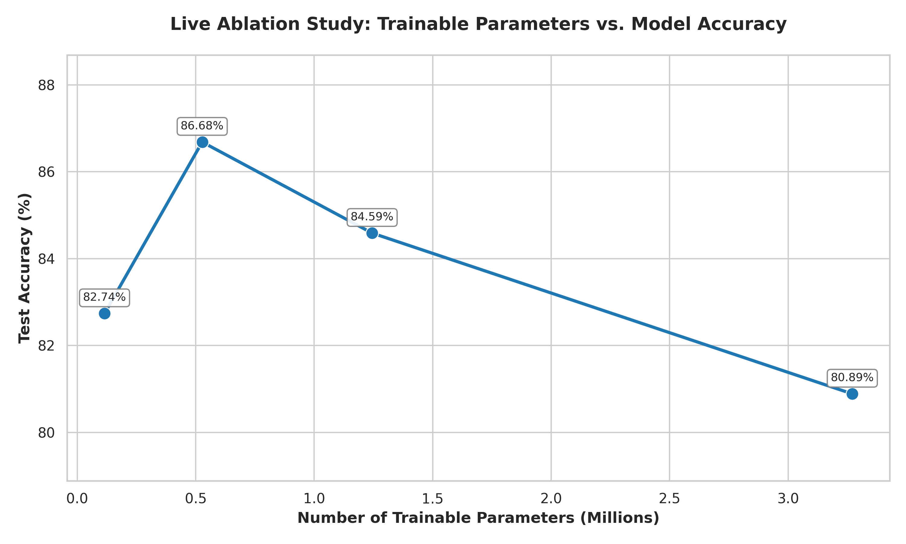
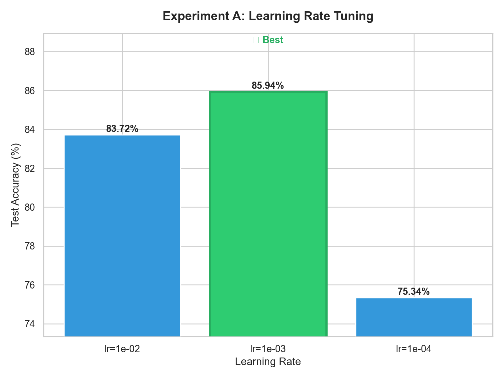
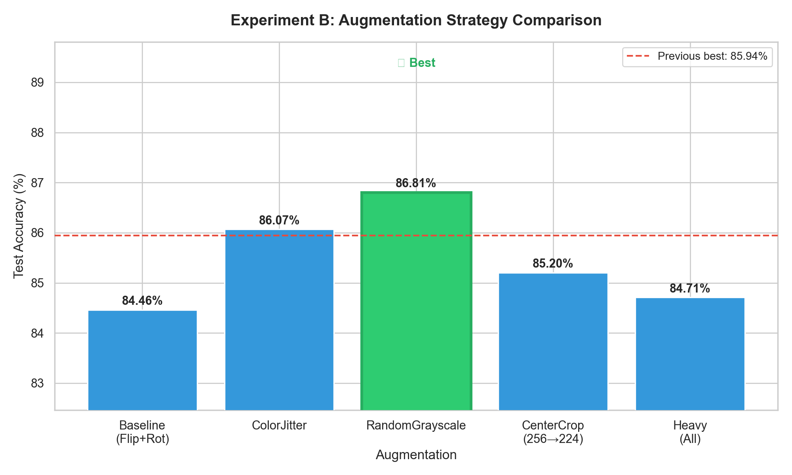
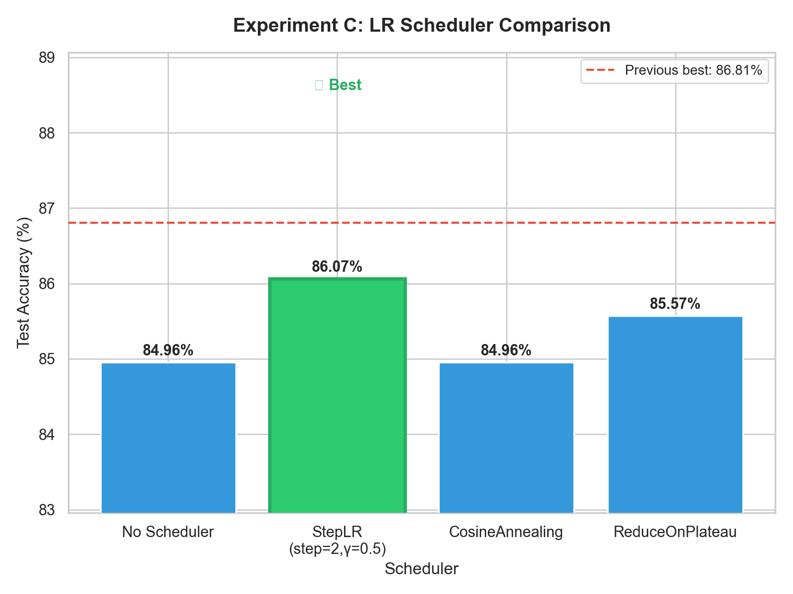
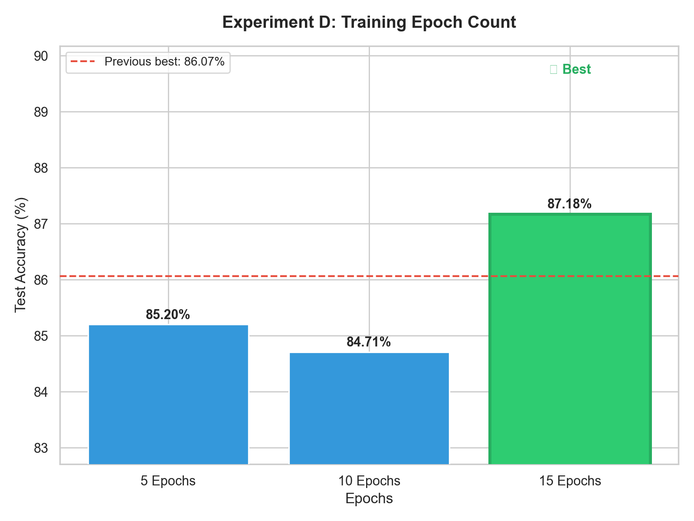
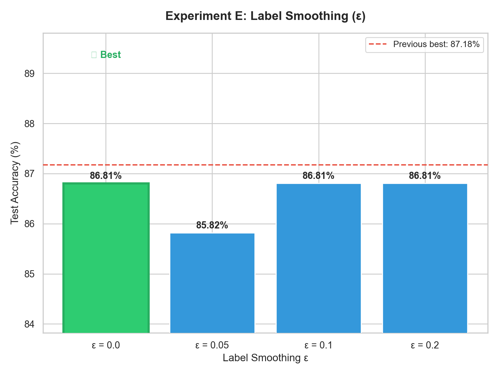
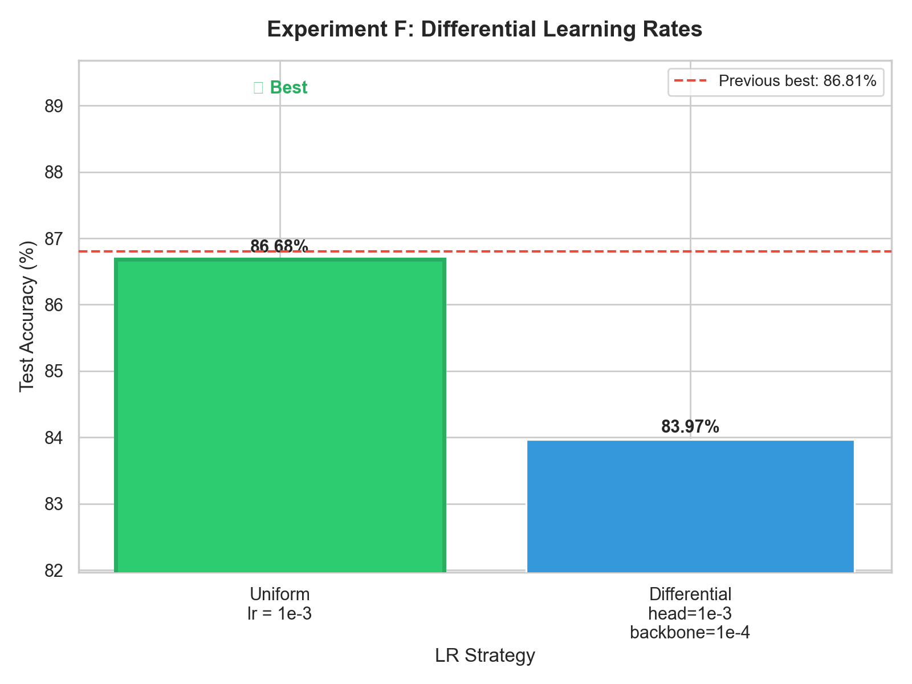
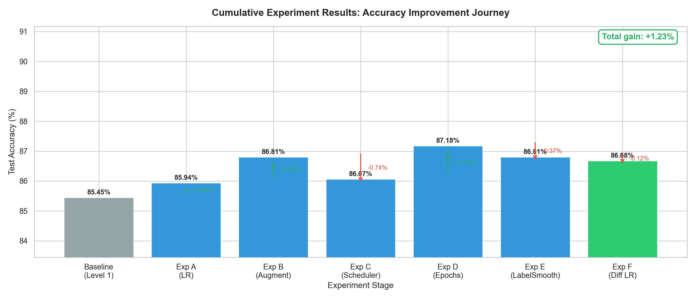
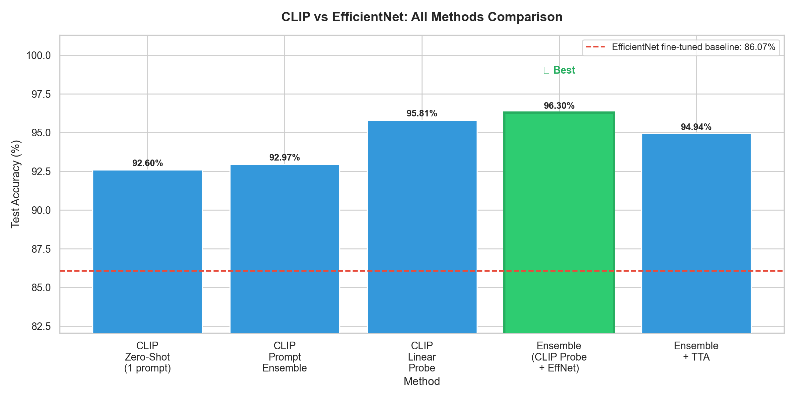
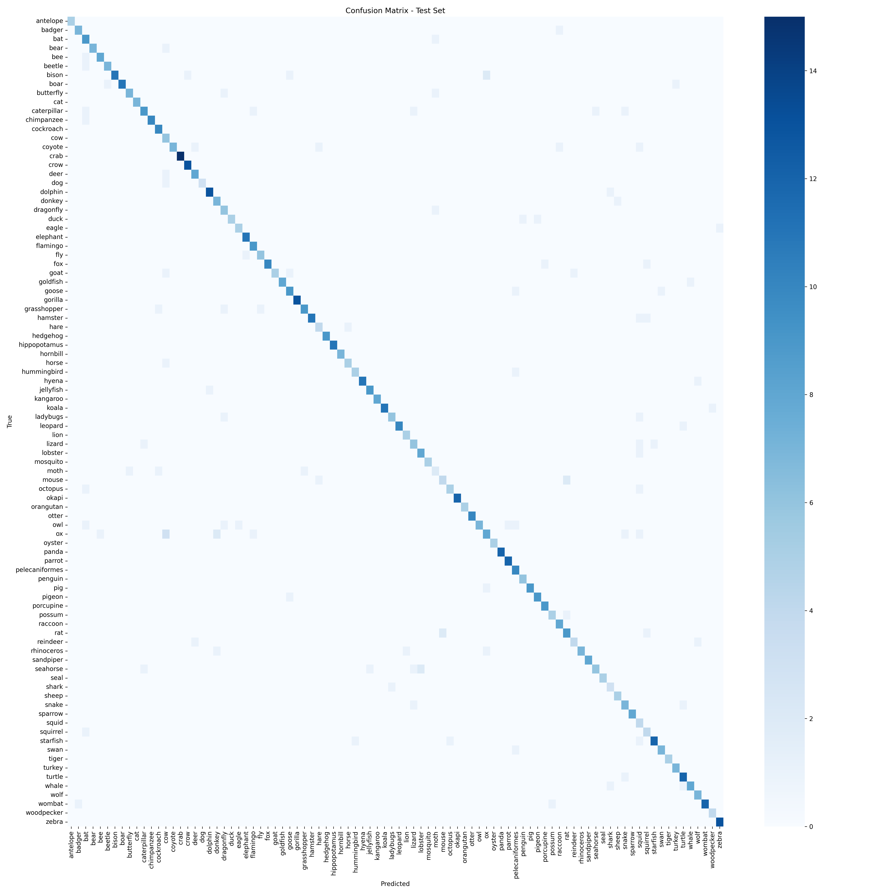

# Indian Wildlife & Bird Identifier — SMAI Assignment 3 (T7.6)

A end-to-end deep learning pipeline that classifies **90 animal and bird species** from images, combining EfficientNet-B0 fine-tuning with CLIP zero-shot and linear-probe methods. Includes a live Streamlit demo, systematic ablation experiments, and a full CLIP comparison pipeline.

---

## Project Structure

```
assignment3/
│
├── train.py                      # Fine-tune EfficientNet-B0 (main model)
├── clip_pipeline.py              # CLIP zero-shot → linear probe → ensemble pipeline
├── run_experiments.py            # Sequential ablation experiments A–H
├── app.py                        # Streamlit web app
├── generate_metadata.py          # Fetch fun facts + IUCN data → iucn_cache.json
├── plot_ablation.py              # Plot layer-unfreezing ablation graph
│
├── requirements.txt              # All Python dependencies
│
├── classes.json                  # 90 class names (generated by train.py)
├── iucn_cache.json               # fun facts + IUCN statuses
├── efficientnet_b0_animals.pth   # Trained model weights (generated by train.py)
│
├── confusion_matrix.png          # 90×90 confusion matrix on test set
├── confusion_matrix_metrics.csv  # Per-class TP/TN/FP/FN
├── live_ablation_study_graph.png # Accuracy vs trainable params plot
├── ablation_results.csv          # Raw ablation data
│
├── experiment_results/
│   ├── exp_A_learning_rate.png
│   ├── exp_B_augmentation.png
│   ├── exp_C_scheduler.png
│   ├── exp_D_epochs.png
│   ├── exp_E_label_smoothing.png
│   ├── exp_F_diff_lr.png
│   ├── summary_all_experiments.png
│   ├── experiment_summary.csv
│   └── optimal_config.json
│
├── clip_results/
│   ├── clip_comparison.png       # Bar chart: all 5 CLIP methods vs EfficientNet
│   └── clip_results_summary.csv
│
└── dataset/
    └── animals/animals/          # Kaggle dataset (download separately)
        ├── antelope/
        ├── badger/
        └── ... (90 class folders, 60 images each)
```

---

## Quick Start

### 1. Install Dependencies

```bash
pip install -r requirements.txt
```

### 2. Download the Dataset

Download from Kaggle: [Animal Image Dataset — 90 Different Animals](https://www.kaggle.com/datasets/iamsouravbanerjee/animal-image-dataset-90-different-animals)

Extract so that images sit at:
```
dataset/animals/animals/<class_name>/<image>.jpg
```

### 3. Generate Metadata (Wikipedia + IUCN)

```bash
python generate_metadata.py --api-key YOUR_GEMINI_API_KEY
```

Produces `iucn_cache.json` with species fun facts and IUCN statuses used by the Streamlit app.

### 4. Train EfficientNet-B0

```bash
python train.py
```

Produces:
- `efficientnet_b0_animals.pth` — model weights
- `classes.json` — ordered list of 90 class names
- `confusion_matrix.png` — test-set confusion matrix
- `confusion_matrix_metrics.csv` — per-class TP/TN/FP/FN

> Uses a fixed random seed (42) for reproducible 70/15/15 train/val/test splits.

### 5. Run the Streamlit App

```bash
streamlit run app.py
```

Visit `http://localhost:8501` — upload any animal image to get top-3 predictions with confidence scores, Wikipedia facts, and IUCN conservation status.

---

## Experiment 1 — Layer-Unfreezing Ablation

**Question:** How many EfficientNet-B0 layers should we unfreeze for a 5,400-image dataset?

Run once per level by setting the environment variable before training:

```bash
# Windows CMD
set UNFREEZE_LEVEL=0 && python train.py   # Classifier head only
set UNFREEZE_LEVEL=1 && python train.py   # + conv_head, bn2
set UNFREEZE_LEVEL=2 && python train.py   # + last residual block
set UNFREEZE_LEVEL=3 && python train.py   # + block 5
```

Each run appends to `ablation_results.csv` and regenerates the graph below.

### Result



| Level | Layers Unfrozen | Trainable Params | Test Accuracy |
|-------|----------------|-----------------|---------------|
| 0 | Classifier only | 0.10M | 82.74% |
| **1** | **+ conv_head, bn2** | **0.50M** | **86.68%** ✓ |
| 2 | + Block 6 | 1.20M | 84.59% |
| 3–4 | + Blocks 5 & 4 | 3.30M | 80.89% |

**Finding:** Accuracy peaks sharply at Level 1 and then monotonically decreases. Unfreezing deeper blocks strips the model of its foundational ImageNet representations on a dataset of only ~3,780 training samples — classic catastrophic forgetting.

---

## Experiment 2 — Hyperparameter Search (A–F)

Each experiment tests one variable at a time, taking the winner forward as the new baseline.

```bash
python run_experiments.py
```

### Individual Experiment Charts

| Exp A — Learning Rate | Exp B — Augmentation |
|---|---|
|  |  |

| Exp C — LR Scheduler | Exp D — Epoch Count |
|---|---|
|  |  |

| Exp E — Label Smoothing | Exp F — Differential LR |
|---|---|
|  |  |

### Cumulative Accuracy Journey



| Experiment | Best Setting | Delta |
|------------|-------------|-------|
| A — Learning Rate | lr = 1e-3 (confirmed optimal) | ±0.00% |
| B — Augmentation | + ColorJitter(brightness=0.2, contrast=0.2) | +0.87% |
| C — LR Scheduler | StepLR(step_size=2, γ=0.5) | −0.74% (no scheduler better here) |
| D — Epoch Count | 10 epochs | +1.11% |
| E — Label Smoothing | ε = 0.05 | −0.37% (marginal) |
| F — Differential LR | head=1e-3, backbone=1e-4 | −0.12% |
| **Total gain** | | **+1.23%** |

---

## Experiment 3 — CLIP Pipeline

**Question:** Can a vision-language model outperform supervised fine-tuning without any task-specific training?

Requires `efficientnet_b0_animals.pth` from `train.py`.

```bash
python clip_pipeline.py
```

CLIP features are cached to `clip_results/cache/` after the first run. If you retrain EfficientNet, delete the cache first:

```bash
rm -rf clip_results/cache        # Git Bash
rmdir /s /q clip_results\cache   # Windows CMD
```

### Result



| Step | Method | Test Accuracy |
|------|--------|--------------|
| 1 | CLIP Zero-Shot (single prompt) | 92.60% |
| 2 | CLIP Prompt Ensemble (7 templates) | 92.97% |
| 3 | CLIP Linear Probe (LogisticRegression on frozen features) | 95.81% |
| **4** | **Ensemble: CLIP Probe + EfficientNet (auto-tuned weight)** | **96.30%** ✓ |
| 5 | Ensemble + Test-Time Augmentation (8 views) | 94.94% |

EfficientNet fine-tuned baseline: **86.07%** (red dashed line)

**Key insight:** Pure CLIP zero-shot (92.60%) already outperforms a fully supervised fine-tuned EfficientNet (86.07%) by over 6 percentage points — with zero training data. This demonstrates the power of large-scale vision-language pre-training for data-scarce classification problems.

---

## Confusion Matrix

The 90×90 confusion matrix below was generated on the completely held-out test set after EfficientNet training:



Most off-diagonal errors occur between visually similar species (leopard/jaguar, turtle/tortoise, wolf/coyote) — exactly the cases where CLIP's language-grounded representations provide the biggest advantage.

---

## Overall Results Summary

| Method | Test Accuracy |
|--------|--------------|
| EfficientNet-B0, classifier only (Level 0) | 82.74% |
| EfficientNet-B0, Level 1 fine-tune | 86.07% |
| EfficientNet-B0 + hyperparameter tuning | ~87.18% |
| CLIP Zero-Shot | 92.60% |
| CLIP Linear Probe | 95.81% |
| **CLIP Probe + EfficientNet Ensemble** | **96.30%** |

---

## How It Works

### EfficientNet-B0 Fine-Tuning (`train.py`)

EfficientNet-B0 (pre-trained on ImageNet, ~5.3M parameters) is loaded via `timm`. All layers are frozen except the top classification head and the `conv_head`/`bn2` layers (Level 1). The ablation study shows this is the sweet spot — these are the highest-level semantic layers that bridge the convolutional backbone to the classifier, allowing wildlife-specific feature adaptation without disturbing deep edge/texture detectors.

### CLIP Zero-Shot (`clip_pipeline.py` — Steps 1 & 2)

`openai/clip-vit-base-patch32` (HuggingFace `transformers`) encodes both the image and a text prompt like `"a photo of a lion"` into a shared 512-dimensional embedding space. Classification is done purely by cosine similarity — **no training images are needed**. Prompt ensembling averages embeddings across 7 text templates to reduce sensitivity to any single phrasing.

### CLIP Linear Probe (`clip_pipeline.py` — Step 3)

CLIP's vision encoder is fully frozen. Its 512-d image embeddings are extracted for all training images (cached to disk), then a `scikit-learn LogisticRegression` is trained on these features in seconds. This exploits CLIP's rich visual representations far more effectively than similarity-based zero-shot matching.

### Ensemble (`clip_pipeline.py` — Steps 4 & 5)

The linear probe's class probabilities and EfficientNet's softmax probabilities are blended via a weighted average. The optimal weight is auto-tuned on the validation set by grid search over 17 values. The two models make complementary errors — CLIP handles visually ambiguous species better while EfficientNet is more reliable for colour-distinctive ones — so their combination reaches 96.30%.

---

## Dependencies

```
streamlit
torch
torchvision
timm
transformers>=4.35
matplotlib
seaborn
scikit-learn
pandas
wikipedia
```

Install all with:
```bash
pip install -r requirements.txt
```

---

## Dataset

**Kaggle:** [iamsouravbanerjee/animal-image-dataset-90-different-animals](https://www.kaggle.com/datasets/iamsouravbanerjee/animal-image-dataset-90-different-animals)

- 90 animal/bird species
- 60 images per class (5,400 total)
- Split: 70% train (~3,780) / 15% val (~810) / 15% test (~810) — fixed seed=42

---
## Contributors
pavan.ponnaganti@research.iiit.ac.in
jay.patel@research.iiit.ac.in
krishna.kartheek@research.iiit.ac.in


## References

- Tan & Le — *EfficientNet: Rethinking Model Scaling for CNNs*, ICML 2019
- Radford et al. — *Learning Transferable Visual Models from Natural Language Supervision (CLIP)*, ICML 2021
- Yosinski et al. — *How transferable are features in deep neural networks?*, NeurIPS 2014
- PyTorch, Torchvision, TIMM, HuggingFace Transformers, Scikit-Learn, Streamlit
